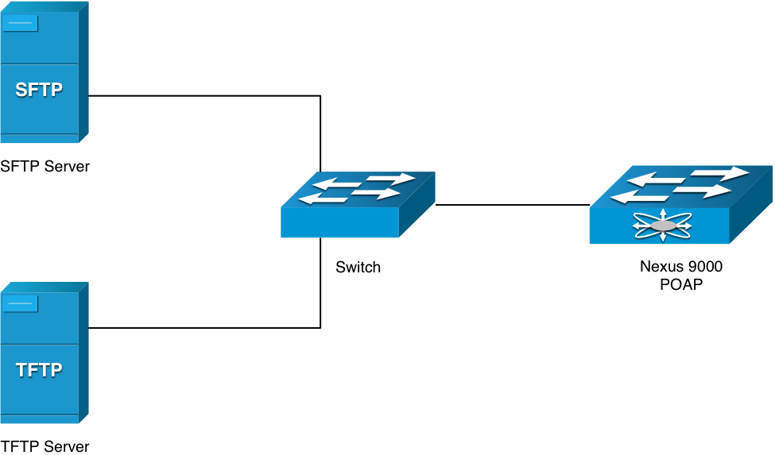

##Cisco Nexus 9K POAP Scripts

####Description
These python scripts perform very simple POAP (Power-on Auto Provisioning) for the Nexus 9K Switches.   The purpose of these scripts are to automate the process of upgrading software images and installing configuration files on devices that are being deployed in the network for the first time.

####Prerequisites for POAP
The following are required for the basic POAP functionality
* DHCP Server
* TFTP Server
* FTP/SFTP Server
* POAP python script
* NXOS Image
* Configuration File



#### High-Level Steps
* Configure DHCP Server
* Modify poap.py for POAP workflow
* Download images and configuration files
* Power on Switch
* Verification

#### Versions of Python Scripts
poap.py
* Script will update IOS image based upon variable in script
* If NXOS on switch does not match the "n9k_image_version" variable it will download the new image and replace it
* Download conf and apply this configuration to all switches

poap-sn.py
* Same as poap.py but script will determine the serial number of the switch and download a custom conf.{Serial Num} specific for that switch
 

#### Detailed Steps

##### Configuration of DHCP Server
Any DHCP Server can be used, but you will need to specify two DHCP options within the pool:
* Option 150 - Specifies the IP Address of the TFTP Server on the network
* Option 67 - Specifies the name of the POAP Script that will be executed

The following shows the example for configuring IOS DHCP:

```buildoutcfg
ip dhcp excluded-address 10.0.0.1 10.0.0.99
!
ip dhcp pool poap-pool
   network 10.0.0.0 255.255.255.0
   default-router 10.0.0.1
   option 150 ip 10.0.0.5
   option 67 ascii "poap.py"
```

##### Modification of Script
The script will need to be modified to include the required information on the location of configuration files as well as the image files.   The following are the variables defined in the scripts that should be modified:

* n9k_image_version - Version of code to install on switch
* config_file_src - location of the configuration file
* image_dir_dst - location of the image destination (Normally bootflash:)
* protocol - Protocol used to download images and configuration
* username - username for the server to download images and conf
* ftp_username - username for the server to download images and conf
* password - Password for the above server
* hostname - hostname or ip address for the above server

After the modification of the script, an embedded MD5 hash must be regenerated.   The Nexus 9K switches use this information to ensure the integrity of the POAP script file.  I do the following:
* Delete the line in the script file prefixed by: "#md5sum"
* Recalculate the hash:
```
$ md5 poap.py
MD5 (poap.py) = 37fefa53d35cc2ceefaca998bb5422d1
```
* Add the "#md5sum" back into the POAP file with the newly generated hash in the above step
```
#md5sum=“37fefa53d35cc2ceefaca998bb5422d1"
```

##### Download Images and Configuration Files
```buildoutcfg
CBOGDON-M-702L:ftproot cbogdon$ ls –l
total 865984
-rwxrwxrwx  1 cbogdon  staff       3112 Aug 25 08:43 conf
-rwxrwxrwx  1 cbogdon  staff         33 Aug 27 07:26 conf.md5
-rwxrwxrwx  1 cbogdon  staff  443319296 Aug 25 08:35 n9000-dk9.7.0.3.I1.3.bin
-rwxrwxrwx  1 cbogdon  staff         32 Aug 25 16:17 n9000-dk9.7.0.3.I1.3.bin.md5
-rwxrwxrwx  1 cbogdon  staff      20305 Aug 27 08:13 poap.py
CBOGDON-M-702L:ftproot cbogdon$
```
The above directory structure shows the files required
* conf - The configuration file that will be applied to the 9K switch
* conf.md5 - A file containing an MD5 hash of the configuration file to ensure integity
* n9000*.bin - The Nexus 9K image downloaded from cisco.com to be installed on the switch
* n9000*.bin.md5 - md5 Hash of the above Nexus 9K image to ensure integrity
* poap.py - Python script for the POAP functionality

##### Power on Switch

The Console of the switch will provide great debugging opportunities:
What will happen if everything is successful:
* POAP initiated
```buildoutcfg
2015 Aug 27 12:50:35  %$ VDC-1 %$ %VDC_MGR-2-VDC_ONLINE: vdc 1 has come online
Waiting for system online status before starting POAP ...
2015 Aug 27 12:51:03 switch %$ VDC-1 %$ %VMAN-2-ACTIVATION_STATE: Successfully activated virtual service 'guestshell+'
2015 Aug 27 12:51:03 switch %$ VDC-1 %$ %VMAN-2-GUESTSHELL_ENABLED: The guest shell has been enabled. The command 'guestshell' may be used to access it, 'guestshell destroy' to remove it.
Waiting for system online status before starting POAP ...
Starting Auto Provisioning ...
Done

```
* Initiate the DHCP Process
```buildoutcfg
switch %$ VDC-1 %$ %POAP-2-POAP_DHCP_DISCOVER_START: POAP DHCP Discover phase started
2015 Aug 27 12:51:49 switch %$ VDC-1 %$ %POAP-2-POAP_INFO: Using DHCP, information received over mgmt0 from 10.0.0.1
2015 Aug 27 12:51:49 switch %$ VDC-1 %$ %POAP-2-POAP_INFO: Assigned IP address: 10.0.0.106
2015 Aug 27 12:51:49 switch %$ VDC-1 %$ %POAP-2-POAP_INFO: Netmask: 255.255.255.0
2015 Aug 27 12:51:49 switch %$ VDC-1 %$ %POAP-2-POAP_INFO: Default Gateway: 10.0.0.1
2015 Aug 27 12:51:49 switch %$ VDC-1 %$ %POAP-2-POAP_INFO: Script Server: 10.0.0.5
2015 Aug 27 12:51:49 switch %$ VDC-1 %$ %POAP-2-POAP_INFO: Script Name: poap.py
2015 Aug 27 12:51:59 switch %$ VDC-1 %$ %POAP-2-POAP_INFO: The POAP Script download has started

```
* Nexus 9K downloaded the poap.py via TFTP
```buildoutcfg
2015 Aug 27 12:51:59 switch %$ VDC-1 %$ %POAP-2-POAP_INFO: The POAP Script is being downloaded from [copy tftp://10.0.0.5/poap.py bootflash:scripts/script.sh vrf management ]
2015 Aug 27 12:52:00 switch %$ VDC-1 %$ %POAP-2-POAP_SCRIPT_DOWNLOADED: Successfully downloaded POAP script file
2015 Aug 27 12:52:00 switch %$ VDC-1 %$ %POAP-2-POAP_INFO: Script file size 20305, MD5 checksum 90fca5573654d65bf715d9397d13a17d
2015 Aug 27 12:52:00 switch %$ VDC-1 %$ %POAP-2-POAP_INFO: MD5 checksum received from the script file is 90fca5573654d65bf715d9397d13a17d
2015 Aug 27 12:52:00 switch %$ VDC-1 %$ %POAP-2-POAP_SCRIPT_STARTED_MD5_VALIDATED: POAP script execution started(MD5 validated)

```
* Downloaded the nxos image using FTP
* Downloaded the configuraiton file using FTP
* Modified the boot variables on the switch
* Copied the file to "scheduled-config" which will be automatically applied at Startup
```buildoutcfg
2015 Aug 27 12:55:18 switch %$ VDC-1 %$ %VMAN-2-GUESTSHELL_ENABLED: The guest shell has been enabled. The command 'guestshell' may be used to access it, 'guestshell destroy' to remove it.
Applying scheduled configuration...
Syntax error while parsing 'limit-resource port-channel minimum 0 maximum 768'

2015 Aug 27 12:55:40 Nexus9K %$ VDC-1 %$ %COPP-2-COPP_POLICY: Control-Plane is protected with policy copp-system-p-policy-strict.
Performing image verification and compatibility check, please wait....
Copy complete.
[########################################] 100%
Copy complete.
Auto provisioning

```
